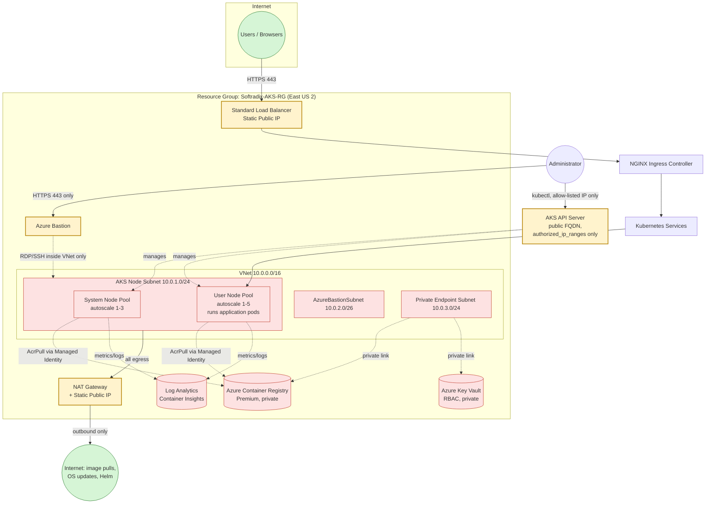
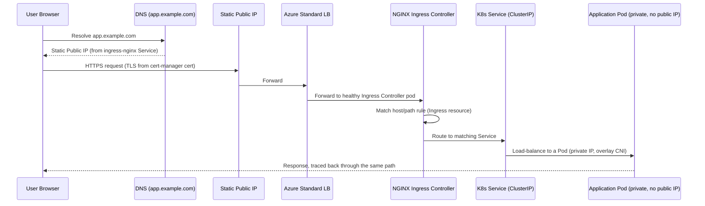
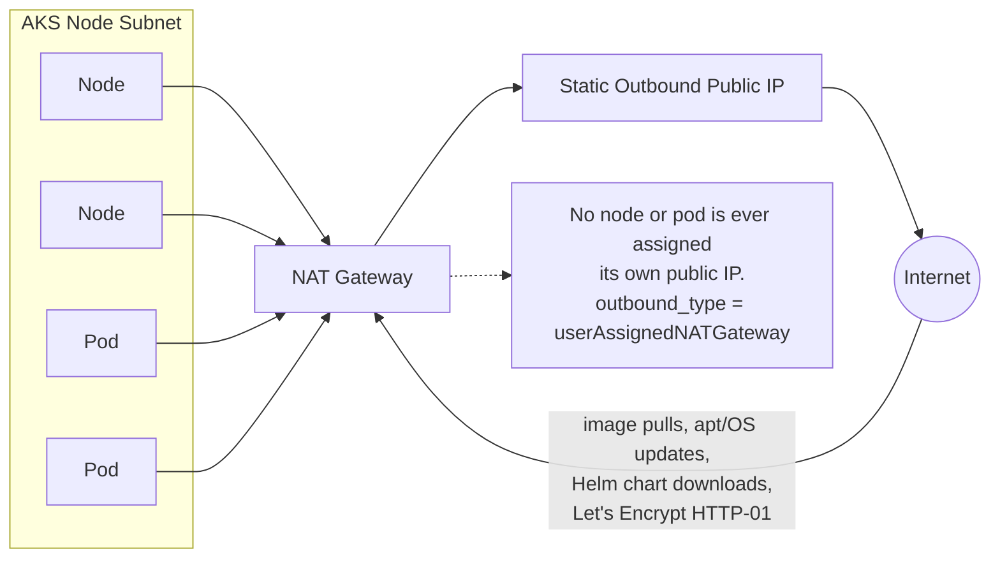
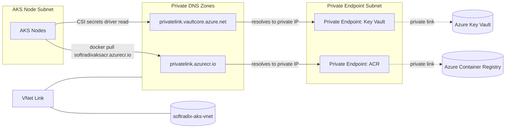
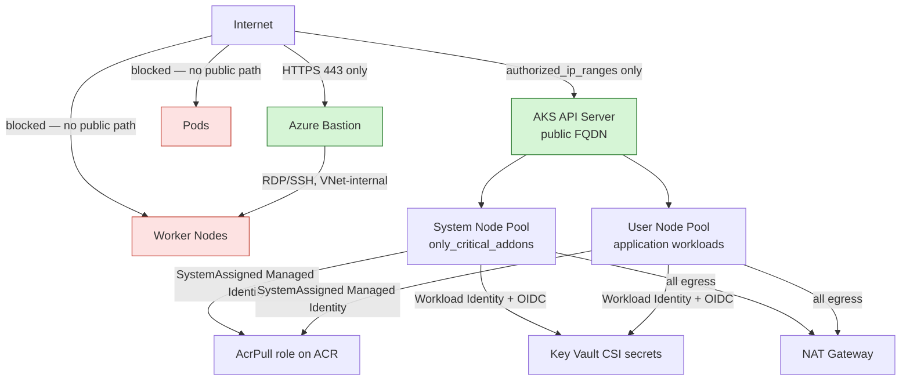
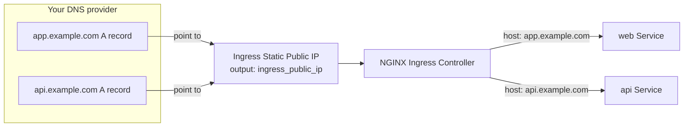
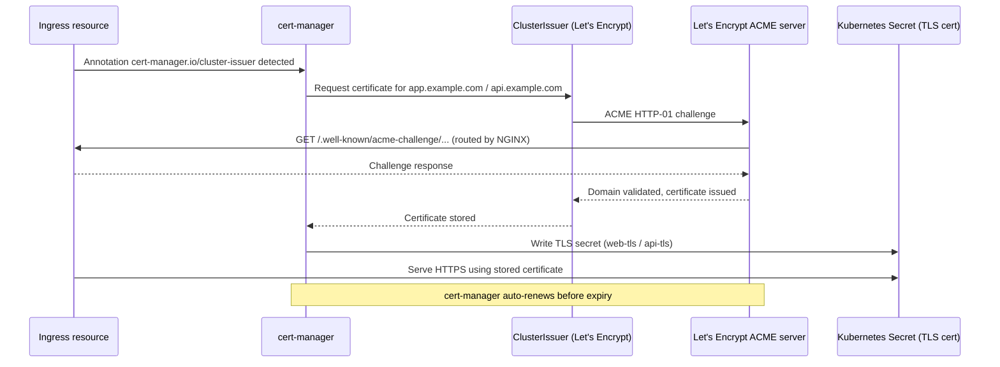
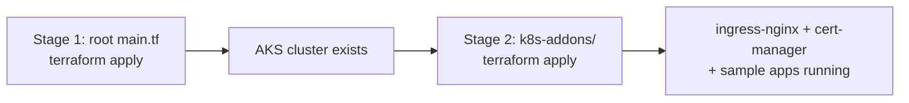

# Private AKS with Public Applications — Terraform

Production-ready Azure Kubernetes Service (AKS) infrastructure where the
**cluster is fully private** (no public node IPs, locked-down API server,
private ACR/Key Vault) while the **applications running on it are publicly
reachable** through a single hardened entry point.

Branch: `feature/private-aks-production-hardening`

---

## 1. What changed and why

| Area | Before | After | Why |
|---|---|---|---|
| Subnets | 3 public + 3 private, only 1 used | 1 AKS-node subnet, `AzureBastionSubnet`, 1 Private-Endpoint subnet — **all private** | No public subnets means nothing in the VNet can be assigned a public IP by accident |
| Egress | None configured (default Azure SNAT) | Dedicated **NAT Gateway** attached to the node subnet, `outbound_type = "userAssignedNATGateway"` | Predictable, non-exhausting, auditable single egress path |
| ACR | Public network access enabled | Public access disabled by default + Private Endpoint + Premium network rules | Registry traffic never touches the internet |
| Key Vault | Did not exist | New module: RBAC auth, purge protection, soft delete, Private Endpoint | Central, private secret storage, ready for Workload Identity |
| AcrPull role | Not created — manual step | `azurerm_role_assignment` in root `main.tf`, fully automatic | No manual `az role assignment create` steps, no drift |
| Node pools | User pool commented out | User pool enabled (autoscale 1-5), apps scheduled here; system pool stays `only_critical_addons_enabled` | Workloads isolated from system add-ons |
| Monitoring | None | Log Analytics Workspace + Container Insights + AKS `oms_agent` | Cluster and pod-level observability out of the box |
| Admin access | Implied SSH / public exposure | Azure Bastion + Microsoft's documented NSG rule set | Zero public SSH/RDP surface |
| Public ingress | Not defined | NGINX Ingress Controller + Standard LB + **one static public IP** | Single, well-known internet entry point |
| TLS | Not defined | cert-manager + Let's Encrypt `ClusterIssuer` (staging & production) | Automatic HTTPS certificate issuance/renewal |
| State files | `terraform.tfstate*` committed to git | Removed from git, added to `.gitignore` | State can contain secrets in plaintext; never belongs in version control |
| API server | Public, `authorized_ip_ranges` already present | Kept public-with-allowlist by default; `private_cluster_enabled` variable added for a fully private option | Matches the requirement ("only my public IP") while leaving room to go fully private later |

Everything above is implemented by **editing your existing modules in
place** — no module was renamed, and the folder layout (`modules/<name>/
{main,variables,outputs}.tf`) is unchanged. Five new modules were added
(`nat-gateway`, `bastion`, `key-vault`, `log-analytics`, `private-endpoints`)
following the exact same structure as your existing ones.

---

## 2. Repository layout

```text
.
├── main.tf                     # Root: wires every module together
├── variables.tf                # Root variables
├── terraform.tfvars            # Environment values (edit authorized_ip_ranges!)
├── outputs.tf
├── providers.tf                # azurerm only — kept minimal on purpose (see §7)
├── versions.tf
├── modules/
│   ├── resource-group/         # unchanged
│   ├── virtual-network/        # rewritten: 3 private subnets + NSGs
│   ├── nat-gateway/            # NEW: single egress path for the node subnet
│   ├── bastion/                # NEW: AzureBastionSubnet + Bastion host + required NSG
│   ├── key-vault/              # NEW: RBAC, purge protection, private-endpoint ready
│   ├── log-analytics/          # NEW: workspace + Container Insights solution
│   ├── private-endpoints/      # NEW: generic PE + Private DNS zone + VNet link, used for ACR & KV
│   ├── acr/                    # updated: public access togglable, network rules
│   └── aks/                    # updated: user pool, oms_agent, KV secrets provider, NAT egress
└── k8s-addons/                 # SEPARATE stage — see §11
    ├── providers.tf            # kubernetes/helm providers, pointed at the AKS cluster
    ├── main.tf                 # ingress-nginx, cert-manager, ClusterIssuers, sample web+api apps, Ingress
    ├── variables.tf
    ├── outputs.tf
    └── terraform.tfvars.example
```

---

## 3. Architecture



---

## 4. Internet traffic flow (public app path)



This is the **only** inbound path into the platform. Nodes and Pods are
never reachable directly from the internet — only the Ingress Controller's
Service (backed by the Standard Load Balancer + single static IP) is
internet-facing.

---

## 5. Networking / egress flow



---

## 6. Private Endpoint flow (ACR / Key Vault)



All name resolution for ACR/Key Vault stays inside the VNet — public DNS
never returns a public IP for these resources once `public_network_access_enabled = false`.

---

## 7. AKS security model



Key points:
- `authorized_ip_ranges` on the API server means `kubectl` only works from
  your listed IPs (or through a jump host inside the VNet reachable via
  Bastion). Set `private_cluster_enabled = true` in `terraform.tfvars` if
  you want the API server to have **no** public endpoint at all.
- **The NAT Gateway's public IP is automatically appended to
  `authorized_ip_ranges`** (see root `main.tf`). This is required, not
  optional: nodes reach the API server through the same NAT Gateway used
  for all other egress, so the API server sees connections from the NAT
  Gateway's IP, not the node's private IP. AKS only auto-allows this for
  the *Standard Load Balancer* outbound type — with a bring-your-own NAT
  Gateway (`userAssignedNATGateway`) it is not automatic, and omitting it
  causes cluster creation to fail with `VMExtensionError_K8SAPIServerConnFail`
  because nodes can never register with the control plane.
- Nodes use `vnet_subnet_id` pointed at the private AKS node subnet only —
  there is no code path that gives a node a public IP.
- `AcrPull` is granted automatically via `azurerm_role_assignment` in the
  root `main.tf`; nobody runs a manual `az role assignment create`.

---

## 8. DNS flow



After `terraform apply` in `k8s-addons/`, read the `ingress_public_ip`
output and create two `A` records at your DNS provider pointing
`app.example.com` and `api.example.com` at that IP. The Ingress resource
in `k8s-addons/main.tf` already routes by hostname.

---

## 9. TLS flow



Start with `letsencrypt_environment = "staging"` in `k8s-addons/
terraform.tfvars` (no rate limits, browsers will flag the cert as
untrusted — that's expected). Once HTTP-01 challenges are confirmed
working end-to-end, switch to `"production"` and re-apply.

---

## 10. Module descriptions

| Module | Purpose |
|---|---|
| `resource-group` | Creates/manages `Softradix-AKS-RG`. Unchanged. |
| `virtual-network` | One VNet, three **private** subnets (AKS nodes, AzureBastionSubnet, Private Endpoints), NSGs on the AKS-node and PE subnets denying inbound internet traffic. |
| `nat-gateway` | Standard SKU NAT Gateway + static public IP, associated only with the AKS node subnet. This is the cluster's only egress path. |
| `bastion` | Standard SKU Azure Bastion + Microsoft's documented NSG rule set for `AzureBastionSubnet`. Toggle with `enable_bastion`. |
| `key-vault` | RBAC-authorized Key Vault, purge protection + soft delete, `public_network_access_enabled` togglable (defaults to `false`), network ACLs default-deny. |
| `log-analytics` | Log Analytics Workspace + `ContainerInsights` solution, wired into AKS via `oms_agent`. |
| `private-endpoints` | Generic, reusable module — pass it a map of `{resource_id, subresource_name, private_dns_zone_name}` and it creates the Private Endpoint, Private DNS Zone, and VNet Link for each. Used for ACR and Key Vault; add Storage the same way. |
| `acr` | Premium SKU, admin disabled, `public_network_access_enabled` togglable (defaults to `false`), `network_rule_set { default_action = "Deny" }`. |
| `aks` | Azure CNI Overlay, OIDC + Workload Identity enabled, `authorized_ip_ranges` on the API server, system pool (`only_critical_addons_enabled`) + user pool (application workloads), `outbound_type = "userAssignedNATGateway"`, Key Vault CSI secrets provider, `oms_agent` wired to Log Analytics. |
| `k8s-addons` (separate root module) | NGINX Ingress + static public IP, cert-manager + staging/production `ClusterIssuer`s, sample `web`/`api` Deployments+Services, hostname-based Ingress. See §11 for why this is separate. |

---

## 11. Why `k8s-addons` is a separate Terraform root

The `kubernetes` and `helm` providers need a live cluster (kubeconfig) to
authenticate against **before** Terraform can plan anything that uses them.
Mixing them into the same `terraform apply` that *creates* the AKS cluster
is a well-known chicken-and-egg problem in Terraform and causes flaky
plans on `destroy`/first-`apply`. Keeping cluster provisioning and
workload deployment as two lifecycles is also a common Well-Architected
pattern (infra team owns the cluster, app/platform team owns what runs on
it).



---

## 12. Deployment steps

### Prerequisites
```bash
az login
terraform -version   # >= 1.5.0
```

### Stage 1 — Infrastructure (VNet, AKS, ACR, Key Vault, NAT GW, Bastion)
```bash
# From the repo root
terraform init
terraform plan
terraform apply
```
Edit `terraform.tfvars` first — in particular set `authorized_ip_ranges`
to **your** current public IP (`curl ifconfig.me`), and confirm globally
unique names for `acr_name` and `key_vault_name`.

```bash
az aks get-credentials \
  --resource-group Softradix-AKS-RG \
  --name softradix-aks-cluster \
  --overwrite-existing

kubectl get nodes
```

### Stage 2 — Ingress, TLS, sample apps
```bash
cd k8s-addons
cp terraform.tfvars.example terraform.tfvars
# edit: letsencrypt_email, app_hostname, api_hostname

terraform init
terraform plan
terraform apply
```

Grab the ingress IP and point your DNS at it:
```bash
terraform output ingress_public_ip
```

Create `A` records:
```
app.example.com  ->  <ingress_public_ip>
api.example.com  ->  <ingress_public_ip>
```

Verify (staging cert will show as untrusted — expected):
```bash
curl -vk https://app.example.com
curl -vk https://api.example.com
```

Once confirmed, switch `letsencrypt_environment = "production"` in
`k8s-addons/terraform.tfvars` and re-apply for a trusted certificate.

---

## 13. Troubleshooting (issues actually hit during first deployment)

These are documented here because they happened during the real first
`apply` of this configuration — they're not hypothetical.

**"Provider produced inconsistent result" / random 404 "Not Found" on a
brand-new Resource Group.** Azure Resource Manager isn't always
immediately consistent across read replicas right after a Resource Group
is created. Firing multiple independent modules at it in parallel (the
Terraform default) can trip this. Fixed by inserting a one-time
`time_sleep.resource_group_propagation` (30s) that `virtual_network`,
`log_analytics`, and `key_vault` all depend on before touching the RG.

**Same error, but for `AzureBastionSubnet`, during VNet creation.** Azure
holds an implicit lock on a VNet while writing a subnet to it; creating
several subnets on a *brand-new* VNet in parallel routinely produces the
same transient 404s. Fixed by chaining subnet creation with explicit
`depends_on` in `modules/virtual-network/main.tf` (`aks_nodes` →
`bastion` → `private_endpoints`) so they're created one at a time instead
of concurrently.

**`enable_rbac_authorization` deprecation warning.** Renamed to
`rbac_authorization_enabled` in `azurerm` provider 4.x; the old name is
removed entirely in v5. Already fixed in `modules/key-vault/main.tf`.

**Cluster creation fails with `VMExtensionError_K8SAPIServerConnFail`
("Node ... could not reach API server ... Connection timed out").** This
is the one worth understanding, not just patching: with
`outbound_type = "userAssignedNATGateway"`, every node's traffic —
including nodes registering with the API server during bootstrap — is
SNAT'd through the NAT Gateway's public IP. Azure automatically
allow-lists the cluster's egress IP in `authorized_ip_ranges` **only**
when the outbound type is the Standard Load Balancer; it does **not** do
this automatically for a bring-your-own NAT Gateway. Without an explicit
fix, the nodes are blocked from ever reaching the control plane they're
supposed to join. Fixed in root `main.tf` by appending the NAT Gateway's
public IP to the list before it's passed into the `aks` module:
```hcl
authorized_ip_ranges = concat(
  var.authorized_ip_ranges,
  ["${module.nat_gateway.public_ip_address}/32"]
)
```
If you ever change `authorized_ip_ranges` manually outside this pattern
(e.g. via `az aks update`), remember: allow-list changes can take up to
two minutes to propagate — don't assume a fix is broken if it fails
immediately after applying, retry after a short wait.

---

## 14. Best practices already applied

- No hardcoded values — everything flows through `variables` / `locals` /
  `terraform.tfvars`.
- Consistent `tags` map passed to every module.
- `terraform.tfstate*` removed from git's tracked files and added to
  `.gitignore` — state can contain plaintext secrets and must never be
  committed. **Recommendation:** migrate to an `azurerm` remote backend
  (Storage Account + Blob container, with state locking) before your next
  `apply` — see the note below.
- ACR/Key Vault default to `public_network_access_enabled = false` — flip
  to `true` only transiently if you need to bootstrap before Private
  Endpoint DNS is verified.
- `AcrPull` is created by Terraform, not by a manual CLI step, eliminating
  a common source of "pods can't pull images" drift.
- Autoscaling on both node pools (system 1-3, user 1-5) instead of fixed
  node counts.

## 15. Production recommendations (not yet automated — call these out to your team)

> **Remote state backend.** Add a `backend "azurerm" {}` block to
> `versions.tf` pointing at a Storage Account with versioning + soft
> delete enabled, so state is shared, locked, and recoverable.

> **Web Application Firewall.** For internet-facing production traffic,
> consider fronting the Standard Load Balancer with **Azure Front Door**
> or **Application Gateway (WAF_v2)** instead of exposing the Load
> Balancer's IP directly, to get L7 filtering, bot protection, and
> DDoS-adjacent mitigations beyond Azure's basic network-layer DDoS
> protection.

> **Azure Policy / OPA Gatekeeper.** Enforce "no privileged pods", "no
> hostNetwork", and "images must come from `softradixaksacr.azurecr.io`"
> at admission time.

> **Private cluster.** Set `private_cluster_enabled = true` once your
> team has Bastion/VPN-based `kubectl` access sorted, to remove the API
> server's public FQDN entirely.

> **Storage private endpoint.** If/when you add an `azurerm_storage_account`
> module, wire it into the existing `private-endpoints` module the same
> way ACR and Key Vault are — no new module needed, just add an entry to
> the `endpoints` map in root `main.tf`.