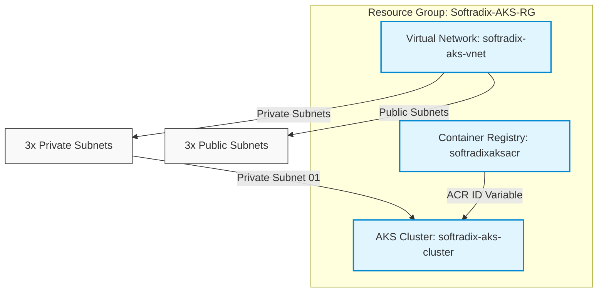

# Azure Kubernetes Service (AKS) Infrastructure with Terraform

This repository contains modular Terraform configurations to provision a secure, scalable, and production-ready **Azure Kubernetes Service (AKS)** cluster integrated with **Azure Container Registry (ACR)** and a custom **Virtual Network (VNet)**.

---

## Architecture Overview

The infrastructure is broken down into reusable modules. Below is a diagram illustrating the component relationships and resource dependency flow:



---

## Project Directory Structure

```text
.
├── main.tf                  # Root Terraform configuration orchestrating the modules
├── variables.tf             # Root variables definition
├── terraform.tfvars         # Environment-specific configuration values
├── providers.tf             # AzureRM provider configuration
├── versions.tf              # Terraform & provider version constraints
├── outputs.tf               # Resource Group output definitions
└── modules/                 # Reusable infrastructure components
    ├── resource-group/      # Module to provision Azure Resource Group
    │   ├── main.tf
    │   ├── variables.tf
    │   └── outputs.tf
    ├── virtual-network/     # Module to provision VNet & custom subnets
    │   ├── main.tf
    │   ├── variables.tf
    │   └── outputs.tf
    ├── acr/                 # Module to provision Azure Container Registry
    │   ├── main.tf
    │   ├── variables.tf
    │   └── outputs.tf
    └── aks/                 # Module to provision AKS Cluster & System Pools
        ├── main.tf
        ├── variables.tf
        └── outputs.tf
```

---

## Module Configurations

### 1. [Resource Group](file:///Users/yogeshsharma/work/AKS/modules/resource-group)
Provisions the lifecycle container for all resources.
- **Resource**: `azurerm_resource_group`

### 2. [Virtual Network](file:///Users/yogeshsharma/work/AKS/modules/virtual-network)
Establishes a custom network partition.
- **Resources**: `azurerm_virtual_network`, `azurerm_subnet` (public/private using `for_each`)
- **Subnets**: Parses input maps to provision multiple public and private subnets dynamically.

### 3. [Azure Container Registry (ACR)](file:///Users/yogeshsharma/work/AKS/modules/acr)
A secure registry to host container images.
- **Resource**: `azurerm_container_registry`
- **Features**: Premium SKU enabled by default (supports zone redundancy). Public network access is enabled, and admin user is disabled (relying on AD/token authentication).

### 4. [Azure Kubernetes Service (AKS)](file:///Users/yogeshsharma/work/AKS/modules/aks)
A managed Kubernetes cluster with advanced integrations.
- **Resource**: `azurerm_kubernetes_cluster`
- **Features**:
  - **SKU Tier**: Standard
  - **Identity**: SystemAssigned Managed Identity
  - **CNI Networking**: Azure CNI with overlay mode (`network_plugin = "azure"`, `network_plugin_mode = "overlay"`)
  - **Security**: 
    - OIDC Issuer & Workload Identity enabled for secure, keyless Azure integrations.
    - API Server Access restricted to specific CIDR ranges using `authorized_ip_ranges`.
  - **Node Pools**:
    - **System Pool**: Autoscale-enabled (1 node min/max) system pool running critical system add-ons on `Standard_D2s_v7` nodes.
    - **User Node Pool**: *(Currently commented out in code; can be enabled in `modules/aks/main.tf` if required).*

---

## Configuration Variables (`terraform.tfvars`)

The infrastructure can be customized via the `terraform.tfvars` file. Default settings include:

| Variable | Type | Default Value | Description |
| :--- | :--- | :--- | :--- |
| `resource_group_name` | `string` | `"Softradix-AKS-RG"` | Target Azure Resource Group name |
| `location` | `string` | `"East US"` | Azure Region |
| `vnet_name` | `string` | `"softradix-aks-vnet"` | Virtual Network name |
| `vnet_address_space` | `list(string)` | `["10.0.0.0/16"]` | Network address prefix CIDR |
| `public_subnets` | `map(string)` | `3 subnets (10.0.1.0/24 to 10.0.3.0/24)` | Maps of public subnets |
| `private_subnets` | `map(string)` | `3 subnets (10.0.10.0/24 to 10.0.30.0/24)` | Maps of private subnets |
| `acr_name` | `string` | `"softradixaksacr"` | Global Azure Registry name (must be unique) |
| `acr_sku` | `string` | `"Premium"` | ACR pricing tier |
| `aks_name` | `string` | `"softradix-aks-cluster"` | AKS Cluster Name |
| `dns_prefix` | `string` | `"softradix-aks"` | DNS prefix for cluster API server |
| `kubernetes_version` | `string` | `"1.36.1"` | Cluster Kubernetes Engine version |
| `system_node_vm_size` | `string` | `"Standard_D2s_v7"` | System node pool VM instances size |
| `authorized_ip_ranges`| `list(string)`| `["61.247.230.182/32"]` | Authorized public CIDRs allowed to call API server |

---

## Deployment & Usage Instructions

### Prerequisites
1. Install [Terraform](https://developer.hashicorp.com/terraform/downloads) (version `>= 1.5.0`).
2. Install the [Azure CLI](https://learn.microsoft.com/en-us/cli/azure/install-azure-cli).
3. Authenticate with Azure:
   ```bash
   az login
   ```

### 1. Initialize Working Directory
Downloads provider plugins and sets up local workspace storage:
```bash
terraform init
```

### 2. Validate & Run Execution Plan
Inspect what actions Terraform will perform on the subscription:
```bash
terraform plan
```

### 3. Deploy the Infrastructure
Apply the configurations to Azure:
```bash
terraform apply
```

### 4. Connect to AKS Cluster
After a successful apply, pull credentials for `kubectl`:
```bash
az aks get-credentials --resource-group Softradix-AKS-RG --name softradix-aks-cluster
```

Verify your cluster connection:
```bash
kubectl get nodes
```

---

## Important Architectural Notes

> [!NOTE]
> **State Management**: This configuration is currently configured for a **local state backend**. For collaboration or production, migrate this to an Azure Storage Account (Blob backend) by defining a `backend "azurerm"` block within `versions.tf`.

> [!IMPORTANT]
> **ACR Role Assignments**: The AKS module currently accepts `acr_id` as a variable, but the `AcrPull` role assignment between the AKS kubelet identity and the ACR has not been defined in code. You may need to create an `azurerm_role_assignment` resource assigning the cluster's kubelet identity to the ACR container registry if you intend for pods to pull images directly.

> [!TIP]
> **Scaling User Nodes**: If you require dedicated user node pools, uncomment the `azurerm_kubernetes_cluster_node_pool.user` resource block in [modules/aks/main.tf](file:///Users/yogeshsharma/work/AKS/modules/aks/main.tf).
